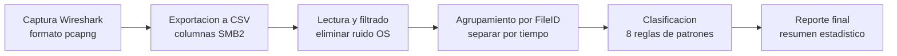
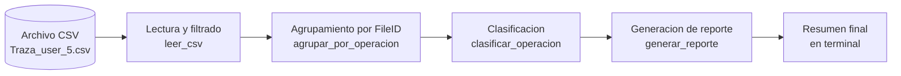
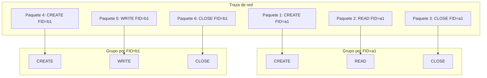
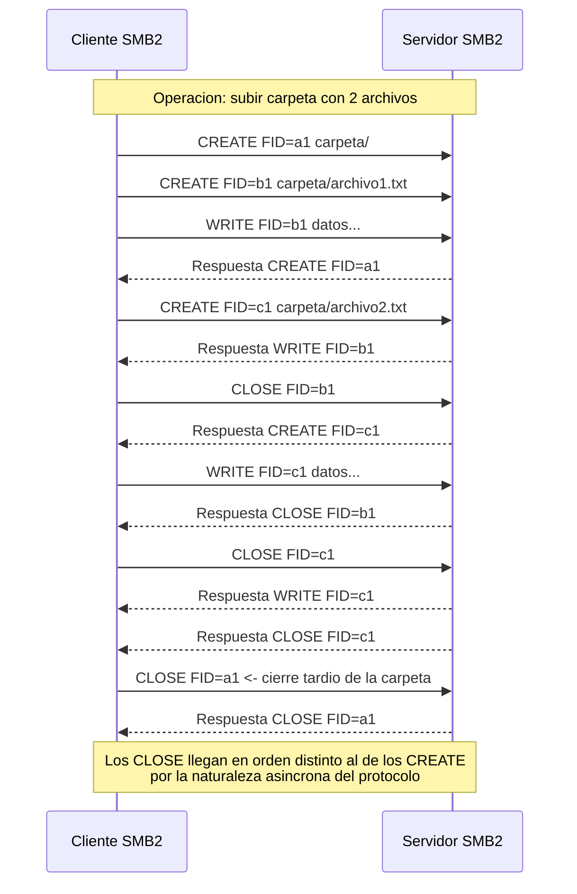
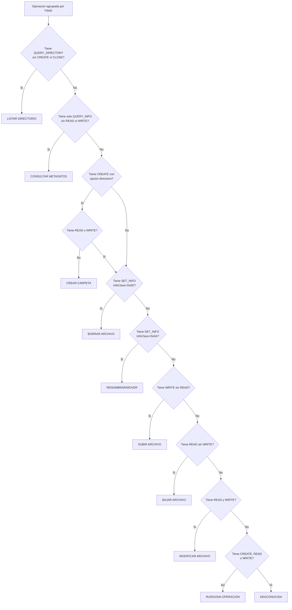

# Documentacion del Analizador de Trafico SMB2

## Indice

1. [Introduccion](#1-introduccion)
   - [Flujo general del analisis](#11-flujo-general-del-analisis)
2. [Estructura del archivo CSV](#2-estructura-del-archivo-csv)
   - [Formato del archivo](#21-formato-del-archivo)
   - [Comandos SMB2 relevantes](#22-comandos-smb2-relevantes)
   - [Comandos de ruido](#23-comandos-de-ruido)
3. [Arquitectura del analizador](#3-arquitectura-del-analizador)
   - [Estructuras de datos](#31-estructuras-de-datos)
   - [Flujo de ejecucion](#32-flujo-de-ejecucion)
4. [Agrupamiento por FileID](#4-agrupamiento-por-fileid)
   - [El concepto de FileID](#41-el-concepto-de-fileid)
   - [Ejemplo de agrupamiento](#42-ejemplo-de-agrupamiento)
   - [Umbral temporal](#43-umbral-temporal)
5. [El problema de la asincronia](#5-el-problema-de-la-asincronia)
   - [Naturaleza asincrona de SMB2](#51-naturaleza-asincrona-de-smb2)
   - [Implicaciones para el analisis](#52-implicaciones-para-el-analisis)
   - [Ejemplo de asincronia](#53-ejemplo-de-asincronia)
6. [Clasificacion de operaciones](#6-clasificacion-de-operaciones)
   - [Reglas de clasificacion](#61-reglas-de-clasificacion)
   - [Arbol de decision](#62-arbol-de-decision-de-clasificacion)
   - [Codigos de informacion SET_INFO](#63-codigos-de-informacion-set_info)
   - [Opciones de creacion CREATE](#64-opciones-de-creacion-create)
   - [Operaciones no clasificadas](#65-operaciones-no-clasificadas-desconocida)
7. [Analisis de resultados](#7-analisis-de-resultados)
   - [Resultados obtenidos](#71-resultados-obtenidos)
   - [Interpretacion](#72-interpretacion)
   - [Validacion manual](#73-validacion-manual)
8. [Limitaciones y trabajo futuro](#8-limitaciones-y-trabajo-futuro)
   - [Limitaciones actuales](#81-limitaciones-actuales)
   - [Posibles mejoras](#82-posibles-mejoras)

---

## 1. Introduccion

El protocolo SMB2 Server Message Block version 2 es un protocolo de red utilizado principalmente para compartir archivos, impresoras y otros recursos en redes Windows. En el contexto de la computacion en la nube, servicios como OneDrive, Google Drive o Dropbox utilizan SMB2 para la sincronizacion de archivos entre el cliente local y el servidor remoto.

El objetivo de este analisis es, a partir de una traza de red capturada con Wireshark, identificar automaticamente las operaciones de usuario que se han realizado: subir archivos, descargarlos, borrarlos, renombrarlos, crear carpetas, etc.

### 1.1 Flujo general del analisis

El proceso completo sigue estos pasos:



1. **Captura de trafico** con Wireshark en formato pcapng
2. **Exportacion a CSV** con los campos SMB2 relevantes
3. **Lectura del CSV** y filtrado de paquetes de ruido
4. **Agrupamiento por FileID** para formar operaciones atomicas
5. **Clasificacion** de cada operacion segun los comandos SMB2 que contiene
6. **Generacion del reporte** con el resumen de operaciones detectadas

---

## 2. Estructura del archivo CSV

Wireshark permite exportar paquetes capturados a formato CSV con columnas personalizadas. Para este analisis, las columnas relevantes son:

| Columna | Contenido | Descripcion |
|---------|-----------|-------------|
| 5 | `frame.time_relative` | Timestamp del paquete (segundos desde inicio de captura) |
| 9 | `smb2.cmd` | Comando SMB2 CREATE, READ, WRITE, CLOSE, SET_INFO, etc. |
| 10 | `smb2.nt_status` | Codigo de error 0 = exito, 1 = error |
| 13 | `smb2.tid` | Tree ID identificador de la sesion |
| 14 | `smb2.file_id` | FileID identificador unico del archivo abierto |
| 15 | `smb2.create_options` | Opciones de creacion solo para CREATE |
| 16 | `smb2.set_info.info_class` | Clase de informacion solo para SET_INFO |
| 19 | `smb2.filename` | Ruta del archivo solo para CREATE |

### 2.1 Formato del archivo

El CSV exportado por Wireshark tiene las siguientes caracteristicas:

- **Cabeceras**: Las filas 1 a 14 contienen metadatos de la captura informacion del filtro, estadisticas
- **Datos**: Los paquetes comienzan en la fila 17
- **Separacion**: Punto y coma `;` o coma `,` segun la configuracion regional
- **Codificacion**: UTF-8 con BOM

### 2.2 Comandos SMB2 relevantes

Los comandos SMB2 que nos interesan para el analisis son:

| Comando | Descripcion | Rol en la operacion |
|---------|-------------|---------------------|
| `CREATE` | Abre o crea un archivo | Inicia toda operacion, genera un FileID |
| `READ` | Lee datos del archivo | Descargar, copiar, modificar |
| `WRITE` | Escribe datos en el archivo | Subir, copiar, modificar |
| `CLOSE` | Cierra el archivo | Finaliza la operacion |
| `SET_INFO` | Modifica atributos del archivo | Borrar, renombrar |
| `QUERY_DIRECTORY` | Lista el contenido de un directorio | Navegar, listar |
| `QUERY_INFO` | Consulta metadatos del archivo | Operacion interna del sistema |

### 2.3 Comandos de ruido

Existen comandos SMB2 que son gestionados automaticamente por el sistema operativo y no corresponden a acciones directas del usuario. Estos se filtran y se ignoran en el analisis:

`NEGOTIATE`, `SESSION_SETUP`, `LOGOFF`, `TREE_CONNECT`, `TREE_DISCONNECT`, `ECHO`, `CANCEL`, `LOCK`, `IOCTL`, `CHANGE_NOTIFY`, `OPLOCK_BREAK`, `FLUSH`

---

## 3. Arquitectura del analizador

El analizador se implementa en un unico script de Python [`analizador_smb2.py`](../analizador_smb2.py) que sigue una arquitectura modular en cuatro fases:



### 3.1 Estructuras de datos

**PaqueteSMB2**: Representa un paquete individual extraido del CSV. Almacena:
- `linea`: numero de linea en el CSV
- `comando`: CREATE, READ, WRITE, etc.
- `timestamp`: momento de captura en segundos
- `file_id`: identificador unico del archivo
- `file_path`: ruta del archivo solo en CREATE
- `create_options`: opciones de creacion
- `info_class`: clase de informacion para SET_INFO

**Operacion**: Representa un grupo de paquetes que forman una accion atomica. Almacena:
- `paquetes`: lista de PaqueteSMB2
- `tipo`: clasificacion asignada SUBIR ARCHIVO, BORRAR, etc.
- `archivo`: ruta del archivo involucrado
- `timestamp_inicio` y `timestamp_fin`: intervalo temporal
- `total_read` y `total_write`: volumen de datos transferidos

### 3.2 Flujo de ejecucion

```
1. Leer CSV
   - Abrir archivo
   - Saltar cabeceras filas 1-15
   - Para cada fila, extraer campos y crear PaqueteSMB2
   - Filtrar comandos de ruido

2. Agrupar por FileID
   - Clasificar paquetes por FileID
   - Dentro de cada FileID, separar por saltos temporales > 2s
   - Cada grupo resultante es una Operacion candidata

3. Clasificar
   - Para cada Operacion, analizar los comandos que contiene
   - Aplicar reglas en orden de prioridad
   - Asignar un tipo

4. Generar reporte
   - Listar todas las operaciones detectadas
   - Mostrar resumen estadistico por tipo
```

---

## 4. Agrupamiento por FileID

### 4.1 El concepto de FileID



### 4.1 El concepto de FileID

En SMB2, cuando un cliente quiere acceder a un archivo, primero envia un comando `CREATE` que abre o crea el archivo. El servidor responde con un **FileID** unico que identifica ese "manejador" handle. Todos los comandos posteriores `READ`, `WRITE`, `SET_INFO`, `CLOSE` que operen sobre ese archivo usaran el mismo FileID.

**Cada comando CREATE genera un FileID diferente**, incluso si se trata del mismo archivo fisico. Esto significa que una misma operacion de usuario puede generar multiples FileIDs.

### 4.2 Ejemplo de agrupamiento

Consideremos la siguiente secuencia de paquetes:

```
Linea 46: CREATE  FID=e900  archivo.pdf   -> Inicio sub-operacion 1
Linea 47: CREATE  FID=ed00  archivo.pdf   -> Inicio sub-operacion 2
Linea 48: READ    FID=e900                 -> Lee el archivo original
Linea 49: WRITE   FID=ed00                 -> Escribe el archivo modificado
Linea 50: CLOSE   FID=e900                 -> Fin sub-operacion 1
Linea 51: CLOSE   FID=ed00                 -> Fin sub-operacion 2
```

El agrupamiento por FileID produce **dos operaciones atomicas**:

- **Operacion 1** FID=e900: `CREATE + READ + CLOSE` -> BAJAR ARCHIVO
- **Operacion 2** FID=ed00: `CREATE + WRITE + CLOSE` -> SUBIR ARCHIVO

Aunque juntas forman una accion de "modificar archivo" bajar, modificar y subir, el analisis las separa porque cada una tiene su propio FileID. Esto es intencionado: permite identificar con precision que comandos se ejecutaron sobre cada recurso.

### 4.3 Umbral temporal

Dentro de un mismo FileID, si entre dos paquetes consecutivos pasa mas de **2 segundos**, se considera que son operaciones distintas. Esto evita que paquetes residuales de una operacion anterior se mezclen con la siguiente.

---

## 5. El problema de la asincronia

### 5.1 Naturaleza asincrona de SMB2

SMB2 permite que el cliente envie multiples solicitudes sin esperar la respuesta de cada una. Esto significa que:

- Los comandos pueden **solaparse temporalmente**: un CREATE para un archivo puede enviarse antes de que llegue el CLOSE del archivo anterior
- El **orden de llegada** de los paquetes en la traza no refleja necesariamente el orden logico de las operaciones
- Los **CLOSE pueden llegar desordenados**: el cierre de un archivo interno puede registrarse despues del cierre de la carpeta que lo contiene

### 5.2 Implicaciones para el analisis



Esta asincronia tiene consecuencias importantes:

1. **No se puede agrupar por ventana temporal global**: Si agrupamos todos los paquetes que ocurren en un intervalo de 2 segundos, mezclaremos operaciones de diferentes archivos que se ejecutan en paralelo, dando lugar a grupos enormes y sin sentido.

2. **El FileID es la unica referencia fiable**: Cada FileID identifica un hilo de ejecucion independiente. Los paquetes de un mismo FileID siempre pertenecen a la misma operacion atomica, independientemente de cuando lleguen.

3. **Los CLOSE tardios son correctos**: Si un CLOSE llega mucho despues que el resto de la operacion, el umbral temporal lo separa como una operacion independiente que se clasifica como RUIDO/SIN OPERACION. Esto es correcto porque ese CLOSE ya no forma parte de la operacion original.

### 5.3 Ejemplo de asincronia

```
t=0.000  CREATE FID=a1  carpeta/          -> Abre carpeta
t=0.001  CREATE FID=b1  carpeta/archivo   -> Abre archivo dentro
t=0.002  WRITE  FID=b1                     -> Escribe archivo
t=0.003  CLOSE  FID=b1                     -> Cierra archivo
t=0.004  CREATE FID=c1  carpeta/archivo2  -> Abre otro archivo
t=0.005  WRITE  FID=c1                     -> Escribe
t=0.006  CLOSE  FID=c1                     -> Cierra
t=0.500  CLOSE  FID=a1                     -> Cierra carpeta MUCHO DESPUES
```

En este caso, el CLOSE de la carpeta FID=a1 llega 0.5s despues. Como el umbral es 2s, sigue dentro de la misma operacion. Pero si llegara a los 3 segundos, se separaria como una operacion independiente.

---

## 6. Clasificacion de operaciones

### 6.1 Reglas de clasificacion

Cada operacion atomica agrupada por FileID se clasifica segun los comandos SMB2 que contiene. Las reglas se aplican en orden de prioridad:

#### Regla 1: LISTAR DIRECTORIO
- **Patron**: Solo `QUERY_DIRECTORY`, sin `CREATE` ni `CLOSE`
- **Descripcion**: El usuario navega por las carpetas del explorador de archivos
- **Ejemplo**: `QUERY_DIRECTORY` x N

#### Regla 2: CONSULTAR METADATOS
- **Patron**: Solo `QUERY_INFO`, sin operaciones de E/S
- **Descripcion**: El sistema consulta propiedades del archivo tamano, fecha, atributos
- **Ejemplo**: `QUERY_INFO` x N

#### Regla 3: CREAR CARPETA
- **Patron**: `CREATE` con `CreateOptions` incluyendo `0x01` FILE_DIRECTORY_FILE + `CLOSE`
- **Descripcion**: El usuario crea una nueva carpeta
- **Ejemplo**: `CREATE` + `CLOSE`

#### Regla 4: BORRAR ARCHIVO
- **Patron**: `CREATE` + `SET_INFO` con `InfoClass=0x0D` FileDispositionInformation + `CLOSE`
- **Descripcion**: El usuario envia un archivo a la papelera o lo elimina
- **Ejemplo**: `CREATE` + `SET_INFO0x0D` + `CLOSE`

#### Regla 5: RENOMBRAR/MOVER
- **Patron**: `CREATE` + `SET_INFO` con `InfoClass=0x0A` FileRenameInformation + `CLOSE`
- **Descripcion**: El usuario cambia el nombre o mueve el archivo a otra carpeta
- **Ejemplo**: `CREATE` + `SET_INFO0x0A` + `CLOSE`

#### Regla 6: SUBIR ARCHIVO
- **Patron**: `CREATE` + `WRITE` x N + `CLOSE` sin `READ`
- **Descripcion**: El usuario sube un archivo desde su equipo a la nube
- **Ejemplo**: `CREATE` + `WRITE` + `WRITE` + ... + `CLOSE`

#### Regla 7: BAJAR ARCHIVO
- **Patron**: `CREATE` + `READ` x N + `CLOSE` sin `WRITE`
- **Descripcion**: El usuario descarga un archivo desde la nube a su equipo
- **Ejemplo**: `CREATE` + `READ` + `READ` + ... + `CLOSE`

#### Regla 8: MODIFICAR ARCHIVO
- **Patron**: `CREATE` + `READ` x N + `WRITE` x N + `CLOSE`
- **Descripcion**: El usuario abre un archivo, lo lee, lo modifica y lo guarda
- **Ejemplo**: `CREATE` + `READ` + `READ` + `WRITE` + `WRITE` + `CLOSE`

### 6.2 Arbol de decision de clasificacion



### 6.3 Codigos de informacion SET_INFO

El comando `SET_INFO` utiliza el campo `InfoClass` para indicar que atributo del archivo se va a modificar:

| InfoClass | Nombre | Operacion |
|-----------|--------|-----------|
| `0x0A` 10 | `FileRenameInformation` | Renombrar o mover el archivo |
| `0x0D` 13 | `FileDispositionInformation` | Borrar el archivo |

### 6.3 Opciones de creacion CREATE

El comando `CREATE` utiliza el campo `CreateOptions` para indicar el tipo de archivo:

| Valor | Nombre | Significado |
|-------|--------|-------------|
| `0x01` | `FILE_DIRECTORY_FILE` | El recurso es un directorio carpeta |
| `0x20` 32 | `FILE_NON_DIRECTORY_FILE` | El recurso es un archivo normal |
| `0x40` 96 | `FILE_COMPLETE_IF_OPLOCKED` | Comportamiento de oplock |
| `0x100000` 1048576 | `FILE_DELETE_ON_CLOSE` | Borrar al cerrar |

### 6.5 Operaciones no clasificadas DESCONOCIDA

Algunas operaciones no encajan en ninguna regla. Esto puede ocurrir por:

1. **Operaciones incompletas**: Un `CREATE` sin su `CLOSE` correspondiente porque la captura empezo despues o termino antes
2. **Patrones asincronos complejos**: Secuencias de comandos que no siguen el patron tipico CREATE + operacion + CLOSE
3. **Comandos de sistema**: Operaciones internas del cliente SMB2 que no corresponden a acciones directas del usuario

Estas operaciones se etiquetan como `DESCONOCIDA` y pueden analizarse manualmente para identificar nuevos patrones.

---

## 7. Analisis de resultados

### 7.1 Resultados obtenidos

Al ejecutar el analizador sobre la traza `Traza_user_5.csv` con 26.812 paquetes SMB2, se obtuvieron los siguientes resultados:

| Tipo de operacion | Cantidad | Porcentaje |
|-------------------|----------|------------|
| SUBIR ARCHIVO | 2.358 | 44,0% |
| BORRAR ARCHIVO | 1.180 | 22,0% |
| RENOMBRAR/MOVER | 590 | 11,0% |
| BAJAR ARCHIVO | 587 | 10,9% |
| CONSULTAR METADATOS | 567 | 10,6% |
| DESCONOCIDA | 46 | 0,9% |
| RUIDO/SIN OPERACION | 23 | 0,4% |
| CREAR CARPETA | 12 | 0,2% |
| **Total** | **5.363** | **100%** |

### 7.2 Interpretacion

- **99,1% de las operaciones se clasifican correctamente** con solo 8 reglas simples
- La operacion mas frecuente es SUBIR ARCHIVO 44%, lo cual es coherente con un usuario que esta sincronizando archivos con la nube
- Se observa un patron de **BAJAR + SUBIR + RENOMBRAR + BORRAR** que corresponde a la accion de "reemplazar un archivo" el cliente descarga el original, renombra el antiguo, sube el nuevo y borra el renombrado
- Las 46 operaciones DESCONOCIDA 0,9% son casos atipicos que requieren analisis manual

### 7.3 Validacion manual

Para verificar la correccion del analisis, se puede seguir este procedimiento:

1. **Elegir una operacion del reporte** y anotar su numero de lineas
2. **Abrir el CSV** en un editor de hojas de calculo Excel, LibreOffice
3. **Localizar las lineas** indicadas y comprobar los comandos
4. **Verificar la clasificacion**: por ejemplo, si es SUBIR ARCHIVO, deben aparecer CREATE + WRITE + CLOSE

---

## 8. Limitaciones y trabajo futuro

### 8.1 Limitaciones actuales

1. **Operaciones compuestas**: El analisis actual trata cada FileID como una operacion independiente. No agrupa las sub-operaciones que forman una accion de usuario de alto nivel como "subir carpeta completa" que genera multiples FileIDs.

2. **Asincronia**: Los CLOSE que llegan fuera de orden pueden separar operaciones que en realidad pertenecen a la misma accion.

3. **Deteccion de ransomware**: Aunque el analisis identifica correctamente operaciones de MODIFICAR ARCHIVO, no distingue entre una modificacion legitima y un patron de cifrado ransomware muchas lecturas y escrituras en rapida sucesion sobre multiples archivos.

4. **Dependencia del CSV**: El analisis depende de la correcta exportacion desde Wireshark. Campos mal formateados o columnas faltantes pueden afectar los resultados.

### 8.2 Posibles mejoras

1. **Agrupamiento jerarquico**: Implementar un segundo nivel de agrupamiento que fusione operaciones atomicas que comparten la misma ruta base y ocurren en el mismo intervalo temporal.

2. **Deteccion de ransomware**: Anadir una regla que identifique picos anormales de operaciones READ+WRITE sobre muchos archivos diferentes en un intervalo corto de tiempo.

3. **Analisis de volumen**: Incorporar el tamano de los datos transferidos total_read y total_write para distinguir entre operaciones de archivos pequenos y grandes.

4. **Soporte para ODS**: Anadir la capacidad de leer directamente archivos ODS ademas de CSV.

5. **Visualizacion**: Generar graficos con la distribucion temporal de las operaciones para identificar patrones de comportamiento.
