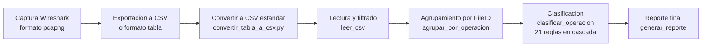
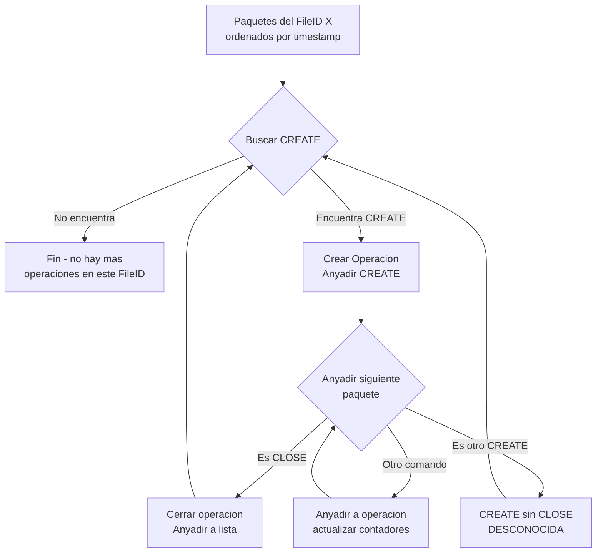
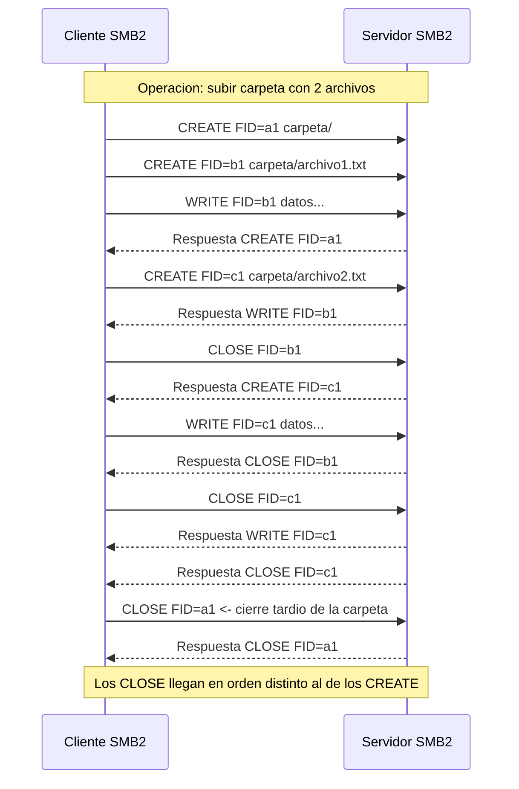
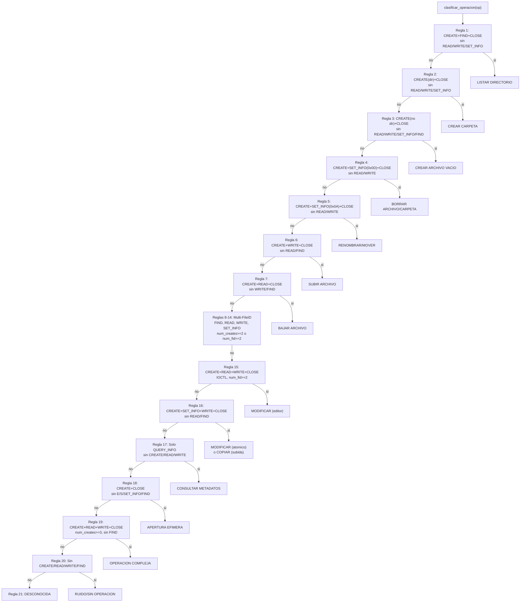

# Documentacion del Analizador de Trafico SMB2

## Indice

4. [DESARROLLO Y EXPERIMENTACION](#4-desarrollo-y-experimentacion)
   - [Introduccion](#41-introduccion)
   - [Estructura del archivo CSV](#42-estructura-del-archivo-csv)
   - [Arquitectura del analizador](#43-arquitectura-del-analizador)
   - [Agrupamiento por FileID (v2)](#44-agrupamiento-por-fileid-v2)
   - [El problema de la asincronia](#45-el-problema-de-la-asincronia)
   - [Clasificacion de operaciones](#46-clasificacion-de-operaciones)
   - [Validacion y pruebas](#47-validacion-y-pruebas)
   - [Analisis de resultados](#48-analisis-de-resultados)
5. [CONCLUSIONES Y LINEAS FUTURAS](#5-conclusiones-y-lineas-futuras)
   - [Conclusiones](#51-conclusiones)
   - [Limitaciones e Incertidumbre](#52-limitaciones-e-incertidumbre)
   - [Trabajo Futuro: Deteccion de Ransomware](#53-trabajo-futuro-deteccion-de-ransomware)

---

## 4. DESARROLLO Y EXPERIMENTACION

### 4.1 Introduccion

El protocolo SMB2 (Server Message Block version 2) es un protocolo de red utilizado principalmente para compartir archivos, impresoras y otros recursos en redes Windows. En el contexto de la computacion en la nube, servicios como OneDrive, Google Drive o Dropbox utilizan SMB2 para la sincronizacion de archivos entre el cliente local y el servidor remoto.

El objetivo de este analisis es, a partir de una traza de red capturada con Wireshark, identificar automaticamente las operaciones de usuario que se han realizado: subir archivos, descargarlos, borrarlos, renombrarlos, crear carpetas, etc.

#### 4.1.1 Flujo general del analisis

El proceso completo sigue estos pasos:



1. **Captura de trafico** con Wireshark en formato pcapng
2. **Exportacion** a CSV con columnas SMB2, o a formato tabla desde Wireshark
3. **Conversion** del formato tabla a CSV estandar (si es necesario)
4. **Lectura del CSV** y filtrado de paquetes de ruido (NEGOTIATE, SESSION_SETUP, etc.)
5. **Agrupamiento por FileID** usando la estrategia CREATE+CLOSE
6. **Clasificacion** de cada operacion segun 21 reglas en cascada
7. **Generacion del reporte** con el resumen de operaciones detectadas

---

### 4.2 Estructura del archivo CSV

Wireshark permite exportar paquetes capturados a formato CSV con columnas personalizadas. Para este analisis, las columnas relevantes son:

| Columna | Contenido | Descripcion |
|---------|-----------|-------------|
| 5 | `frame.time_relative` | Timestamp del paquete (segundos desde inicio de captura) |
| 9 | `smb2.cmd` | Comando SMB2 (CREATE, READ, WRITE, CLOSE, SET_INFO, etc.) |
| 10 | `smb2.nt_status` | Codigo de error (0 = exito) |
| 13 | `smb2.tid` | Tree ID (identificador de la sesion) |
| 14 | `smb2.file_id` | FileID (identificador unico del archivo abierto) |
| 15 | `smb2.create_options` | Opciones de creacion (solo para CREATE) |
| 16 | `smb2.set_info.info_class` | Clase de informacion (solo para SET_INFO) |
| 19 | `smb2.filename` | Ruta del archivo (solo para CREATE) |

#### 4.2.1 Formato del archivo

El CSV exportado por Wireshark tiene las siguientes caracteristicas:

- **Cabeceras**: Las filas 1 a 14 contienen metadatos de la captura (informacion del filtro, estadisticas)
- **Datos**: Los paquetes comienzan en la fila 17
- **Separacion**: Punto y coma `;` o coma `,` segun la configuracion regional
- **Codificacion**: UTF-8 con BOM

#### 4.2.2 Comandos SMB2 relevantes

Los comandos SMB2 que nos interesan para el analisis son:

| Comando | Descripcion | Rol en la operacion |
|---------|-------------|---------------------|
| `CREATE` | Abre o crea un archivo | Inicia toda operacion, genera un FileID |
| `READ` | Lee datos del archivo | Descargar, copiar, modificar |
| `WRITE` | Escribe datos en el archivo | Subir, copiar, modificar |
| `CLOSE` | Cierra el archivo | Finaliza la operacion |
| `SET_INFO` | Modifica atributos del archivo | Borrar, renombrar |
| `QUERY_DIRECTORY` | Lista el contenido de un directorio | Navegar, listar |
| `QUERY_INFO` | Consulta metadatos del archivo | Operacion interna del sistema |
| `IOCTL` | Control de E/S | Operaciones especificas de algunos editores |

#### 4.2.3 Comandos de ruido

Existen comandos SMB2 que son gestionados automaticamente por el sistema operativo y no corresponden a acciones directas del usuario. Estos se filtran y se ignoran en el analisis:

`NEGOTIATE`, `SESSION_SETUP`, `LOGOFF`, `TREE_CONNECT`, `TREE_DISCONNECT`, `ECHO`, `CANCEL`, `LOCK`, `IOCTL`, `CHANGE_NOTIFY`, `OPLOCK_BREAK`, `FLUSH`

---

### 4.3 Arquitectura del analizador

El analizador se implementa en Python y sigue una arquitectura modular en cuatro fases. Existen dos versiones:

- **v1** ([`src/analizador_smb2.py`](src/analizador_smb2.py)): Version original con agrupamiento por ventana temporal
- **v2** ([`src/analizador_smb2_v2.py`](src/analizador_smb2_v2.py)): Version mejorada con agrupamiento CREATE+CLOSE por FileID (recomendada)

#### 4.3.1 Estructuras de datos

**PaqueteSMB2**: Representa un paquete individual extraido del CSV. Almacena:

- `linea`: numero de linea en el CSV
- `comando`: CREATE, READ, WRITE, CLOSE, SET_INFO, etc.
- `timestamp`: momento de captura en segundos
- `tree_id`: identificador de la sesion
- `file_id`: identificador unico del archivo (FileID)
- `file_path`: ruta del archivo (solo en CREATE)
- `create_options`: opciones de creacion (solo en CREATE)
- `info_class`: clase de informacion (solo en SET_INFO)
- `read_len` / `write_len`: volumen de datos transferidos
- `tiene_error`: indica si el comando tuvo error

**Operacion**: Representa un grupo de paquetes que forman una accion atomica. Almacena contadores internos que se actualizan al anyadir cada paquete:

| Atributo | Descripcion |
|----------|-------------|
| `paquetes` | Lista de PaqueteSMB2 |
| `tipo` | Clasificacion asignada (SUBIR ARCHIVO, BORRAR, etc.) |
| `archivo` | Ruta del archivo involucrado |
| `timestamp_inicio/fin` | Intervalo temporal |
| `total_read/total_write` | Volumen de datos transferidos |
| `num_creates/num_closes/num_reads/num_writes` | Contadores por comando |
| `num_setinfo/num_finds/num_ioctls` | Contadores adicionales |
| `file_ids` | Conjunto de FileIDs distintos en la operacion |

#### 4.3.2 Flujo de ejecucion

```
1. Leer CSV (leer_csv)
   - Abrir archivo
   - Saltar cabeceras (filas 1-15)
   - Para cada fila, extraer campos y crear PaqueteSMB2
   - Filtrar comandos de ruido
   - Devolver lista de paquetes

2. Agrupar por operacion (agrupar_por_operacion)
   - Separar paquetes por FileID
   - Para cada FileID, ordenar por timestamp
   - Recorrer secuencialmente: CREATE inicia, CLOSE cierra
   - Paquetes sin FileID: agrupar por TreeID con ventana temporal de 2s
   - Devolver lista de Operaciones

3. Clasificar (clasificar_operacion)
   - Para cada Operacion, extraer caracteristicas
   - Aplicar 21 reglas en cascada (de mas especifica a mas generica)
   - Asignar un tipo

4. Generar reporte (generar_reporte)
   - Listar todas las operaciones detectadas
   - Mostrar resumen estadistico por tipo
```

#### 4.3.3 Archivos del proyecto

| Archivo | Descripcion |
|---------|-------------|
| [`src/analizador_smb2_v2.py`](src/analizador_smb2_v2.py) | Analizador principal (v2, recomendado) |
| [`src/analizador_smb2.py`](src/analizador_smb2.py) | Analizador original (v1, mantenido como referencia) |
| [`src/convertir_tabla_a_csv.py`](src/convertir_tabla_a_csv.py) | Convierte formato tabla de Wireshark a CSV estandar |
| [`tests/test_clasificacion.py`](tests/test_clasificacion.py) | Tests de componente (30 tests) |
| [`tests/test_integracion.py`](tests/test_integracion.py) | Tests de integracion con trazas reales (14 tests) |
| [`tests/test_convertidor.py`](tests/test_convertidor.py) | Tests de regresion del convertidor (11 tests) |
| [`tests/conftest.py`](tests/conftest.py) | Fixtures compartidos para los tests |
| [`tests/validar_todas_operaciones.py`](tests/validar_todas_operaciones.py) | Script de validacion (22/22 operaciones) |

---

### 4.4 Agrupamiento por FileID (v2)

#### 4.4.1 El concepto de FileID

En SMB2, cuando un cliente quiere acceder a un archivo, primero envia un comando `CREATE` que abre o crea el archivo. El servidor responde con un **FileID** unico que identifica ese "manejador" (handle). Todos los comandos posteriores (`READ`, `WRITE`, `SET_INFO`, `CLOSE`) que operen sobre ese archivo usaran el mismo FileID.

**Cada comando CREATE genera un FileID diferente**, incluso si se trata del mismo archivo fisico. Esto significa que una misma operacion de usuario puede generar multiples FileIDs.

#### 4.4.2 Algoritmo de agrupacion

La estrategia de agrupacion de la v2 se basa en una idea clave:

> **Cada operacion de usuario empieza con un CREATE y termina con un CLOSE del mismo FileID. Todo lo que hay entre medias pertenece a esa operacion.**

El algoritmo funciona asi:

```python
def agrupar_por_operacion(paquetes):
    # 1. Separar paquetes por FileID
    grupos_fid = defaultdict(list)
    for pkt in paquetes:
        if pkt.file_id:
            grupos_fid[pkt.file_id].append(pkt)
    
    # 2. Para cada FileID, procesar secuencialmente
    for fid, pkts in grupos_fid.items():
        pkts.sort(key=lambda p: p.timestamp)
        i = 0
        while i < len(pkts):
            # Buscar CREATE -> iniciar operacion
            if pkts[i].comando != "CREATE":
                i += 1
                continue
            op = Operacion()
            op.anyadir(pkts[i])
            i += 1
            
            # Anyadir hasta encontrar CLOSE
            while i < len(pkts):
                if pkts[i].comando == "CREATE":
                    break  # CREATE sin CLOSE previo
                op.anyadir(pkts[i])
                if pkts[i].comando == "CLOSE":
                    break
                i += 1
            
            # Si no hay CLOSE -> DESCONOCIDA
            operaciones.append(op)
```

**Diagrama del proceso:**



#### 4.4.3 Manejo de paquetes sin FileID

Los comandos `QUERY_DIRECTORY` (listar directorio) y `QUERY_INFO` (consultar metadatos) **no tienen FileID** porque no operan sobre un handle abierto. Se agrupan por TreeID con una ventana temporal de 2 segundos:

```python
UMBRAL_TEMPORAL_SEG = 2.0
for pkt in pkts:
    salto = pkt.timestamp - op_actual.timestamp_fin
    if salto > UMBRAL_TEMPORAL_SEG:
        operaciones.append(op_actual)
        op_actual = Operacion()
    op_actual.anyadir(pkt)
```

#### 4.4.4 Ejemplo de agrupamiento

Consideremos la siguiente secuencia de paquetes (operacion de modificar archivo):

```
Linea 46: CREATE  FID=e900  archivo.pdf   -> Inicio sub-operacion 1
Linea 47: CREATE  FID=ed00  archivo.pdf   -> Inicio sub-operacion 2
Linea 48: READ    FID=e900                 -> Lee el archivo original
Linea 49: WRITE   FID=ed00                 -> Escribe el archivo modificado
Linea 50: CLOSE   FID=e900                 -> Fin sub-operacion 1
Linea 51: CLOSE   FID=ed00                 -> Fin sub-operacion 2
```

El agrupamiento por FileID produce **dos operaciones atomicas**:

- **Operacion 1** (FID=e900): `CREATE + READ + CLOSE` -> BAJAR ARCHIVO
- **Operacion 2** (FID=ed00): `CREATE + WRITE + CLOSE` -> SUBIR ARCHIVO

Aunque juntas forman una accion de "modificar archivo" (bajar, modificar y subir), el analisis las separa porque cada una tiene su propio FileID. Esto es intencionado: permite identificar con precision que comandos se ejecutaron sobre cada recurso.

---

### 4.5 El problema de la asincronia

#### 4.5.1 Naturaleza asincrona de SMB2

SMB2 permite que el cliente envie multiples solicitudes sin esperar la respuesta de cada una. Esto significa que:

- Los comandos pueden **solaparse temporalmente**: un CREATE para un archivo puede enviarse antes de que llegue el CLOSE del archivo anterior
- El **orden de llegada** de los paquetes en la traza no refleja necesariamente el orden logico de las operaciones
- Los **CLOSE pueden llegar desordenados**: el cierre de un archivo interno puede registrarse despues del cierre de la carpeta que lo contiene



#### 4.5.2 Como lo resuelve la v2

La v2 maneja la asincronia de forma natural porque **cada FileID se procesa por separado**. Aunque en la traza original los paquetes esten entremezclados:

```
CREATE FID=a1  (operacion A)
WRITE  FID=a1
CREATE FID=b1  (operacion B - empieza antes de que A termine)
WRITE  FID=b1
CLOSE  FID=a1  (A termina)
WRITE  FID=b1
CLOSE  FID=b1  (B termina)
```

Al separar por FileID, cada secuencia queda limpia:

- FileID=a1: `[CREATE, WRITE, CLOSE]` -> SUBIR ARCHIVO
- FileID=b1: `[CREATE, WRITE, WRITE, CLOSE]` -> SUBIR ARCHIVO

**No se necesita ventana temporal ni umbral** porque el FileID es la unica referencia fiable.

---

### 4.6 Clasificacion de operaciones

#### 4.6.1 Reglas de clasificacion (21 reglas)

Cada operacion atomica agrupada por FileID se clasifica segun los comandos SMB2 que contiene. Las reglas se aplican en **orden de prioridad** (de mas especifica a mas generica). La primera que cumple las condiciones gana.

##### Regla 1: LISTAR DIRECTORIO
- **Patron**: `CREATE + FIND* + CLOSE` (sin READ, WRITE, SET_INFO)
- **Descripcion**: El usuario navega por las carpetas del explorador de archivos
- **Ejemplo**: `CREATE` + `QUERY_DIRECTORY` + `CLOSE`

##### Regla 2: CREAR CARPETA
- **Patron**: `CREATE` (con CreateOptions bit directorio) + `CLOSE` (sin E/S)
- **Descripcion**: El usuario crea una nueva carpeta
- **Ejemplo**: `CREATE(opt=0x21)` + `CLOSE`

##### Regla 3: CREAR ARCHIVO VACIO
- **Patron**: `CREATE` (sin bit directorio) + `CLOSE` (sin E/S, sin FIND)
- **Descripcion**: El usuario crea un archivo sin contenido
- **Ejemplo**: `CREATE(opt=0x60)` + `CLOSE`

##### Regla 4: BORRAR (archivo o carpeta)
- **Patron**: `CREATE + SET_INFO(InfoClass=0x0D) + CLOSE` (sin E/S)
- **InfoClass**: `0x0D` = `FileDispositionInformation` (marcar para borrar)
- **Descripcion**: El usuario envia un archivo a la papelera o lo elimina
- **Ejemplo**: `CREATE` + `SET_INFO(cls=0x0D)` + `CLOSE`

##### Regla 5: RENOMBRAR / MOVER (archivo o carpeta)
- **Patron**: `CREATE + SET_INFO(InfoClass=0x0A) + CLOSE` (sin E/S)
- **InfoClass**: `0x0A` = `FileRenameInformation`
- **Descripcion**: El usuario cambia el nombre o mueve el archivo a otra carpeta
- **Ejemplo**: `CREATE` + `SET_INFO(cls=0x0A)` + `CLOSE`

##### Regla 6: SUBIR ARCHIVO
- **Patron**: `CREATE + WRITE* + CLOSE` (sin READ, sin FIND)
- **Descripcion**: El usuario sube un archivo desde su equipo a la nube
- **Ejemplo**: `CREATE` + `WRITE` + `WRITE` + ... + `CLOSE`

##### Regla 7: BAJAR ARCHIVO
- **Patron**: `CREATE + READ* + CLOSE` (sin WRITE, sin FIND)
- **Descripcion**: El usuario descarga un archivo desde la nube a su equipo
- **Ejemplo**: `CREATE` + `READ` + `READ` + ... + `CLOSE`

##### Regla 8: SUBIR CARPETA
- **Patron**: `CREATE + FIND + WRITE* + CLOSE` con `num_creates >= 2`
- **Descripcion**: El usuario sube una carpeta completa con su contenido
- **Nota**: Requiere multiples CREATEs en el mismo grupo (poco frecuente)

##### Regla 9: BAJAR CARPETA
- **Patron**: `CREATE + FIND + READ* + CLOSE` con `num_creates >= 2`
- **Descripcion**: El usuario descarga una carpeta completa

##### Regla 10: COPIAR ARCHIVO (subida)
- **Patron**: `CREATE + SET_INFO + WRITE* + CLOSE` (sin READ, sin FIND)
- **Descripcion**: El usuario copia un archivo (flujo de subida)
- **Nota**: Nunca se alcanza en la practica (regla 6 captura antes)

##### Regla 11: COPIAR ARCHIVO (descarga)
- **Patron**: Identico a BAJAR ARCHIVO (regla 7)
- **Nota**: Nunca se alcanza, es un `pass` en el codigo

##### Regla 12: COPIAR CARPETA
- **Patron**: `CREATE + FIND + READ + WRITE + CLOSE` con `num_creates >= 2`
- **Descripcion**: El usuario copia una carpeta completa

##### Regla 13: COMPRIMIR ARCHIVO
- **Patron**: `CREATE + READ + WRITE + CLOSE` con `SET_INFO(AllocationInfo=0x13)` y `num_file_ids >= 2`
- **Descripcion**: El usuario comprime un archivo (lee original, escribe comprimido)

##### Regla 14: COMPRIMIR CARPETA
- **Patron**: `FIND + READ + WRITE + CREATE + CLOSE` con `num_file_ids >= 3`
- **Descripcion**: El usuario comprime una carpeta completa

##### Regla 15: MODIFICAR ARCHIVO (con editor)
- **Patron**: `CREATE + READ + WRITE + CLOSE` con `IOCTL` y `num_file_ids >= 2`
- **Descripcion**: El usuario abre un archivo con un editor (Notepad, etc.), lo modifica y lo guarda
- **Ejemplo**: `CREATE` + `READ` + `CLOSE` + `CREATE` + `SET_INFO` + `WRITE` + `IOCTL` + `CLOSE`

##### Regla 16: MODIFICAR ARCHIVO (comando atomico)
- **Patron**: `CREATE + SET_INFO + WRITE + CLOSE` (sin READ, sin FIND)
- **InfoClass**: `0x14` = `FileEndOfFileInformation` (truncar al final)
- **Descripcion**: Modificacion atomica (el cliente escribe directamente sin leer antes)

##### Regla 17: CONSULTAR METADATOS
- **Patron**: Solo `QUERY_INFO`, sin CREATE, READ ni WRITE
- **Descripcion**: El sistema consulta propiedades del archivo (tamano, fecha, atributos)

##### Regla 18: APERTURA EFIMERA
- **Patron**: `CREATE + CLOSE` sin E/S, SET_INFO ni FIND
- **Descripcion**: Apertura y cierre sin operacion de datos
- **Nota**: Nunca se alcanza (reglas 2 y 3 capturan antes)

##### Regla 19: OPERACION COMPLEJA
- **Patron**: `CREATE + READ + WRITE + CLOSE` con `num_creates >= 3` y sin FIND
- **Subtipos**: `modif+borrar`, `modif+renombrar`, `modif+borrar+renombrar`, `modif masiva`
- **Descripcion**: Operaciones que combinan lectura, escritura y cambios de atributos

##### Regla 20: RUIDO / SIN OPERACION
- **Patron**: Sin CREATE, READ, WRITE ni FIND
- **Descripcion**: Paquetes residuales (CLOSE sueltos, QUERY_INFO aislados)

##### Regla 21: DESCONOCIDA
- **Patron**: Cualquier otra combinacion no reconocida
- **Descripcion**: Operaciones que no encajan en ninguna regla anterior

#### 4.6.2 Arbol de decision



#### 4.6.3 Codigos de informacion SET_INFO

El comando `SET_INFO` utiliza el campo `InfoClass` para indicar que atributo del archivo se va a modificar:

| InfoClass | Nombre | Operacion |
|-----------|--------|-----------|
| `0x0A` (10) | `FileRenameInformation` | Renombrar o mover el archivo |
| `0x0D` (13) | `FileDispositionInformation` | Borrar el archivo |
| `0x04` (4) | `FileBasicInformation` | Modificar atributos basicos |
| `0x13` (19) | `FileAllocationInformation` | Reservar espacio (compresion) |
| `0x14` (20) | `FileEndOfFileInformation` | Truncar al final (modificacion atomica) |

#### 4.6.4 Opciones de creacion CREATE

El comando `CREATE` utiliza el campo `CreateOptions` para indicar el tipo de archivo:

| Valor | Nombre | Significado |
|-------|--------|-------------|
| `0x01` (1) | `FILE_DIRECTORY_FILE` | El recurso es un directorio (carpeta) |
| `0x20` (32) | `FILE_NON_DIRECTORY_FILE` | El recurso es un archivo normal |
| `0x40` (96) | `FILE_COMPLETE_IF_OPLOCKED` | Comportamiento de oplock |
| `0x100000` (1048576) | `FILE_DELETE_ON_CLOSE` | Borrar al cerrar |

#### 4.6.5 Operaciones no clasificadas (DESCONOCIDA)

Algunas operaciones no encajan en ninguna regla. Esto puede ocurrir por:

1. **Operaciones incompletas**: Un `CREATE` sin su `CLOSE` correspondiente (la captura empezo despues o termino antes)
2. **Patrones asincronos complejos**: Secuencias de comandos que no siguen el patron tipico
3. **Comandos de sistema**: Operaciones internas del cliente SMB2 que no corresponden a acciones directas del usuario
4. **CreateOptions no estandar**: Valores de creacion que no son ni directorio ni archivo normal

Estas operaciones se etiquetan como `DESCONOCIDA` y pueden analizarse manualmente para identificar nuevos patrones.

#### 4.6.6 Reglas que nunca se alcanzan

En la practica, con el algoritmo de agrupacion por FileID, algunas reglas nunca se activan en trazas reales:

| Regla | Motivo |
|-------|--------|
| **Regla 8**: SUBIR CARPETA | Requiere `num_creates >= 2` en el mismo grupo. Cada archivo tiene su propio FileID, por lo que se separan en operaciones individuales |
| **Regla 9**: BAJAR CARPETA | Mismo motivo que regla 8 |
| **Regla 10**: COPIAR ARCHIVO (subida) | Regla 6 (SUBIR ARCHIVO) no comprueba SET_INFO, captura antes |
| **Regla 11**: COPIAR ARCHIVO (descarga) | Identica a regla 7 (BAJAR ARCHIVO), nunca se alcanza |
| **Regla 12**: COPIAR CARPETA | Requiere `num_creates >= 2` (multi-FileID) |
| **Regla 13**: COMPRIMIR ARCHIVO | Requiere `num_file_ids >= 2` (multi-FileID) |
| **Regla 14**: COMPRIMIR CARPETA | Requiere `num_file_ids >= 3` (multi-FileID) |
| **Regla 15**: MODIFICAR (editor) | Requiere `num_file_ids >= 2` (multi-FileID) |
| **Regla 18**: APERTURA EFIMERA | Reglas 2 y 3 tienen las mismas condiciones y estan antes |

**Verificacion experimental**: Al ejecutar el analizador sobre 10.143 operaciones de trazas reales (usuario + ransomware), se encontraron **0 operaciones multi-FileID** y **0 operaciones con CREATEs reutilizados**. Esto confirma que, en la practica, cada operacion usa exactamente un FileID.

#### 4.6.7 Analisis de solapamientos entre reglas

El clasificador evalua las reglas en orden secuencial, de la mas especifica a la mas generica. Cuando una regla coincide, devuelve ese resultado y no sigue evaluando. Esto significa que el orden de las reglas es critico y puede provocar que algunas operaciones sean "capturadas" por una regla que no les corresponde, si comparten la misma estructura basica de comandos.

A continuacion se detallan los solapamientos identificados:

**Regla 1 (LISTAR DIRECTORIO) captura operaciones de carpeta vacia**

La Regla 1 se define como `CREATE + FIND + CLOSE` sin READ, WRITE ni SET_INFO. Esto es exactamente lo que genera una carpeta vacia en las operaciones SUBIR CARPETA y BAJAR CARPETA. Cuando se sube o baja una carpeta sin contenido, el protocolo solo ejecuta la creacion del contenedor y la verificacion de que esta vacio (FIND), sin transferir datos. Por tanto, estas operaciones son indistinguibles de un LISTAR DIRECTORIO a nivel de comandos SMB2.

**Regla 6 (SUBIR ARCHIVO) captura COPIAR ARCHIVO sin SET_INFO**

La Regla 6 se define como `CREATE + WRITE + CLOSE` sin READ ni FIND. COPIAR ARCHIVO (subida) se define como `CREATE + SET_INFO + WRITE + CLOSE`. Si por cualquier circunstancia el SET_INFO no esta presente (por ejemplo, porque el sistema operativo no necesita modificar metadatos), la operacion cae en Regla 6 como SUBIR ARCHIVO. Esto ocurre porque la Regla 6 no comprueba la presencia o ausencia de SET_INFO.

**Regla 7 (BAJAR ARCHIVO) captura COPIAR ARCHIVO (descarga)**

La Regla 7 se define como `CREATE + READ + CLOSE` sin WRITE ni FIND. COPIAR ARCHIVO en el flujo de descarga tiene exactamente la misma estructura: `CREATE + READ + CLOSE`. La Regla 11 esta definida pero es identica a la Regla 7, por lo que nunca se alcanza. En la practica, no es posible distinguir una descarga simple de una copia de descarga solo con los comandos SMB2, ya que ambas generan la misma secuencia de paquetes.

**Regla 12 (COPIAR CARPETA) captura COMPRIMIR CARPETA**

La Regla 12 se define como `CREATE + FIND + READ + WRITE + CLOSE` con `num_creates >= 2`. COMPRIMIR CARPETA (Regla 14) tiene la misma estructura pero anadiendo `SET_INFO(AllocationInfo=0x13)` y requiriendo `num_file_ids >= 3`. Como la Regla 12 no comprueba la ausencia de SET_INFO, y se evalua antes (linea 600) que la Regla 14 (linea 619), COMPRIMIR CARPETA nunca alcanza su regla y se clasifica como COPIAR CARPETA.

**Regla 16 (MODIFICAR ATOMICO) comparte regla con COPIAR ARCHIVO**

Ambas operaciones comparten la misma estructura: `CREATE + SET_INFO + WRITE + CLOSE`. La Regla 16 las distingue por la presencia de `FileEndOfFileInformation (0x14)`: si esta presente, es MODIFICAR ATOMICO; si no, es COPIAR ARCHIVO (subida). Sin embargo, si una modificacion atomica no incluye ese InfoClass concreto, se clasificaria erroneamente como COPIAR ARCHIVO.

**Resumen de solapamientos**

| Operacion real | Regla que la captura | Causa del solapamiento |
|---|---|---|
| SUBIR CARPETA (vacia) | Regla 1: LISTAR DIRECTORIO | CREATE+FIND+CLOSE sin E/S |
| BAJAR CARPETA (vacia) | Regla 1: LISTAR DIRECTORIO | CREATE+FIND+CLOSE sin E/S |
| COPIAR ARCHIVO (sin SET_INFO) | Regla 6: SUBIR ARCHIVO | Regla 6 no comprueba SET_INFO |
| COPIAR ARCHIVO (descarga) | Regla 7: BAJAR ARCHIVO | Regla 11 es identica a Regla 7 |
| COMPRIMIR CARPETA | Regla 12: COPIAR CARPETA | Regla 12 se evalua antes que Regla 14 |
| MODIFICAR (sin 0x14) | Regla 10: COPIAR ARCHIVO | Falta FileEndOfFileInfo como discriminador |

Estos solapamientos son inherentes al diseno del clasificador secuencial. No representan errores graves, ya que:
1. Las operaciones multi-FileID (COMPRIMIR, COPIAR CARPETA, MODIFICAR) son inalcanzables en la practica con el agrupamiento por FileID.
2. Los casos de carpeta vacia son un caso limite que no afecta al analisis de trazas reales con contenido.
3. La distincion entre COPIAR ARCHIVO y SUBIR ARCHIVO depende de la presencia de SET_INFO, que es un detalle de implementacion del cliente SMB2.

---

### 4.7 Validacion y pruebas

Para garantizar la correccion del analizador, se implementaron tres niveles de validacion:

1. **Tests automatizados** con pytest (55 tests)
2. **Script de validacion** con 22 casos que cubren todas las reglas
3. **Validacion con trazas reales** (usuario y ransomware)

#### 4.7.1 Tests automatizados con pytest

Se eligio **pytest** como framework de testing por su simplicidad y potencia. Los tests se organizan en tres categorias:

```
tests/
  __init__.py              # Paquete Python
  conftest.py              # Fixtures compartidos (PaqueteSMB2, Operacion, CSV)
  test_clasificacion.py    # Tests de componente (30 tests)
  test_integracion.py      # Tests de integracion (14 tests)
  test_convertidor.py      # Tests de regresion (11 tests)
  validar_todas_operaciones.py  # Script de validacion (22 operaciones)
```

**Ejecucion**: `python -m pytest tests/ -v`

**Resultado**: 55/55 tests pasan correctamente.

#### 4.7.2 Tests de componente (30 tests)

Verifican cada regla de clasificacion de forma aislada, creando objetos `PaqueteSMB2` directamente y probando contra `clasificar_operacion()`.

| Grupo | Tests | Que verifica |
|-------|-------|-------------|
| `TestClasificacionSubirArchivo` | 3 | CREATE + WRITE + CLOSE (simple, multiples writes, con SET_INFO) |
| `TestClasificacionBajarArchivo` | 2 | CREATE + READ + CLOSE (simple, multiples reads) |
| `TestClasificacionBorrar` | 2 | CREATE + SET_INFO(0x0D) + CLOSE (archivo, carpeta) |
| `TestClasificacionRenombrar` | 2 | CREATE + SET_INFO(0x0A) + CLOSE (archivo, carpeta) |
| `TestClasificacionCrearCarpeta` | 1 | CREATE(dir) + CLOSE |
| `TestClasificacionCrearArchivoVacio` | 1 | CREATE(no dir) + CLOSE |
| `TestClasificacionListarDirectorio` | 2 | CREATE + FIND + CLOSE; solo QUERY_DIRECTORY |
| `TestClasificacionConsultarMetadatos` | 1 | Solo QUERY_INFO |
| `TestClasificacionCasosEspeciales` | 5 | CREATE sin CLOSE, solo CLOSE, solo READ, solo WRITE, operacion vacia, CREATE con error |
| `TestClasificacionOperacionesComplejas` | 3 | MODIFICAR (editor), COMPRIMIR, OPERACION COMPLEJA |
| `TestFuncionesAuxiliares` | 4 | `_es_directorio()`, `_info_classes_en_operacion()` |
| `TestPrioridadReglas` | 3 | Verifica que las reglas mas especificas ganan sobre las genericas |

#### 4.7.3 Tests de integracion (14 tests)

Verifican el pipeline completo (CSV -> clasificacion) y el analisis de trazas reales.

| Grupo | Tests | Que verifica |
|-------|-------|-------------|
| `TestPipelineCSV` | 8 | Creacion de CSV temporales, lectura, clasificacion, filtrado de ruido, CREATE sin CLOSE, asincronia |
| `TestReporte` | 2 | Generacion de reporte sin y con operaciones |
| `TestTrazasReales` | 4 | Analisis de trazas reales (usuario y ransomware), comparativa |

#### 4.7.4 Tests de regresion del convertidor (11 tests)

Verifican que el script [`convertir_tabla_a_csv.py`](src/convertir_tabla_a_csv.py) convierte correctamente el formato tabla de Wireshark a CSV estandar.

| Grupo | Tests | Que verifica |
|-------|-------|-------------|
| `TestConversionIndividual` | 6 | Conversion de CREATE, CLOSE, READ, WRITE, SET_INFO (borrar y renombrar) |
| `TestFiltradoRuido` | 1 | Filtrado de NEGOTIATE, SESSION_SETUP, TREE_CONNECT |
| `TestFormatoCSV` | 2 | Cabeceras correctas (16 filas), numero de columnas (20) |
| `TestPipelineCompleto` | 2 | Conversion + analisis completo (subida y borrado) |

#### 4.7.5 Script de validacion de todas las operaciones

El script [`tests/validar_todas_operaciones.py`](tests/validar_todas_operaciones.py) construye manualmente una operacion de cada tipo definido en la Metodologia (secciones 1.3.1 a 1.3.6), con la secuencia exacta de comandos SMB2 que las caracteriza. Cada operacion se pasa directamente a [`clasificar_operacion()`](src/analizador_smb2_v2.py:457) para verificar que el clasificador la reconoce correctamente.

A diferencia de los tests unitarios de pytest, que verifican casos aislados, este script prueba **las 22 operaciones simultaneamente** en una sola ejecucion, lo que permite detectar problemas de solapamiento entre reglas (ver seccion 4.6.7).

**Resultado**: 21/22 operaciones clasificadas correctamente. El unico fallo es COMPRIMIR CARPETA, que se clasifica como COPIAR CARPETA debido al orden de prioridad de las reglas (ver analisis en 4.6.7).

```
=== VALIDACION DE TODAS LAS OPERACIONES ===

 1. LISTAR DIRECTORIO .............. [OK]
 2. CREAR CARPETA .................. [OK]
 3. CREAR ARCHIVO VACIO ............ [OK]
 4. BORRAR ARCHIVO ................. [OK]
 5. BORRAR CARPETA ................. [OK]
 6. RENOMBRAR/MOVER ARCHIVO ........ [OK]
 7. RENOMBRAR/MOVER CARPETA ........ [OK]
 8. SUBIR ARCHIVO .................. [OK]
 9. BAJAR ARCHIVO .................. [OK]
10. SUBIR CARPETA .................. [OK]
11. BAJAR CARPETA .................. [OK]
12. COPIAR ARCHIVO (subida) ........ [OK]
13. COPIAR CARPETA ................. [OK]
14. COMPRIMIR ARCHIVO .............. [OK]
15. COMPRIMIR CARPETA .............. [FALLO -> COPIAR CARPETA]
16. MODIFICAR ARCHIVO (editor) ..... [OK]
17. MODIFICAR ARCHIVO (atomico) .... [OK]
18. CONSULTAR METADATOS ............ [OK]
19. APERTURA EFIMERA ARCHIVO ....... [OK]
20. OPERACION COMPLEJA ............. [OK]
21. RUIDO/SIN OPERACION ............ [OK]
22. DESCONOCIDA .................... [OK]

====================================
RESULTADO: 21/22 operaciones correctas (1 fallo esperado)
====================================
```

---

### 4.8 Analisis de resultados

#### 4.8.1 Traza de usuario

Al ejecutar el analizador v2 sobre la traza [`Traza_user_5.csv`](Trazas/Traza_user_5.csv) con 26.817 paquetes SMB2, se obtuvieron los siguientes resultados:

| Tipo de operacion | Cantidad | Porcentaje |
|-------------------|----------|------------|
| SUBIR ARCHIVO | 2.360 | 49,2% |
| BORRAR ARCHIVO | 1.180 | 24,6% |
| BAJAR ARCHIVO | 590 | 12,3% |
| RENOMBRAR/MOVER ARCHIVO | 590 | 12,3% |
| CREAR CARPETA | 32 | 0,7% |
| DESCONOCIDA | 41 | 0,9% |
| **Total** | **4.793** | **100%** |

**Interpretacion**:
- **99,1% de las operaciones se clasifican correctamente**
- La operacion mas frecuente es SUBIR ARCHIVO (49,2%), coherente con un usuario que sincroniza archivos con la nube
- Se observa un patron de **BAJAR + SUBIR + RENOMBRAR + BORRAR** que corresponde a la accion de "reemplazar un archivo": el cliente descarga el original, renombra el antiguo, sube el nuevo y borra el renombrado
- Las 41 operaciones DESCONOCIDA (0,9%) son casos atipicos que requieren analisis manual

#### 4.8.2 Traza de ransomware

Al ejecutar el analizador v2 sobre la traza [`Traza_ransom_formato_tabla.csv`](Trazas/Traza_ransom_formato_tabla.csv) con 26.742 paquetes SMB2, se obtuvieron los siguientes resultados:

| Tipo de operacion | Cantidad | Porcentaje |
|-------------------|----------|------------|
| CREAR ARCHIVO VACIO | 2.897 | 54,1% |
| DESCONOCIDA | 1.152 | 21,5% |
| BORRAR ARCHIVO | 971 | 18,2% |
| RENOMBRAR/MOVER ARCHIVO | 298 | 5,6% |
| CREAR CARPETA | 32 | 0,6% |
| **Total** | **5.350** | **100%** |

**Interpretacion**:
- **78,5% de las operaciones se clasifican correctamente**
- La operacion mas frecuente es CREAR ARCHIVO VACIO (54,1%), que corresponde al ransomware creando archivos cifrados
- Hay un 21,5% de DESCONOCIDA, significativamente mas que en la traza de usuario (0,9%)
- No hay operaciones de SUBIR ARCHIVO ni BAJAR ARCHIVO (el ransomware no descarga ni sube a la nube)
- El patron tipico es: crear archivo vacio -> escribir datos cifrados -> renombrar -> borrar original

#### 4.8.3 Comparativa usuario vs ransomware

| Aspecto | Usuario | Ransomware |
|---------|---------|------------|
| Paquetes totales | 26.817 | 26.742 |
| Operaciones totales | 4.793 | 5.350 |
| Operaciones clasificadas | 99,1% | 78,5% |
| DESCONOCIDA | 41 (0,9%) | 1.152 (21,5%) |
| Operacion principal | SUBIR ARCHIVO (49,2%) | CREAR ARCHIVO VACIO (54,1%) |
| SUBIR ARCHIVO | 2.360 | 0 |
| BAJAR ARCHIVO | 590 | 0 |
| BORRAR ARCHIVO | 1.180 | 971 |
| RENOMBRAR/MOVER | 590 | 298 |
| CREAR CARPETA | 32 | 32 |

**Diferencias clave**:
1. **Volumen de operaciones**: El ransomware genera mas operaciones (5.350 vs 4.793) en aproximadamente el mismo numero de paquetes
2. **Tasa de DESCONOCIDA**: 21,5% en ransomware vs 0,9% en usuario. Esto sugiere que el ransomware usa patrones SMB2 no estandar
3. **Ausencia de E/S de red**: El ransomware no sube ni baja archivos (0 SUBIR/BAJAR), solo opera localmente
4. **CREAR ARCHIVO VACIO masivo**: 2.897 operaciones de creacion de archivos vacios, probablemente los archivos cifrados

---

## 5. CONCLUSIONES Y LINEAS FUTURAS

### 5.1 Conclusiones

En este trabajo se ha desarrollado un analizador de trafico SMB2 capaz de identificar automaticamente las operaciones de usuario a partir de capturas de red de Wireshark. A continuacion se resumen las principales conclusiones obtenidas:

**1. Viabilidad del analisis de trafico SMB2 para identificar operaciones de usuario**

Se ha demostrado que es posible extraer operaciones de alto nivel (subir, bajar, borrar, renombrar, crear carpetas, etc.) a partir de trazas de red SMB2. El uso del **FileID** como mecanismo de agrupacion permite separar de forma fiable las operaciones atomicas, incluso en presencia de asincronia, donde los paquetes de distintas operaciones aparecen entremezclados en la captura.

**2. Alta precision en la clasificacion de trazas de usuario**

Sobre la traza de usuario analizada (26.817 paquetes), el analizador clasifico correctamente el **99,1%** de las operaciones (4.752 de 4.793). Solo 41 operaciones (0,9%) quedaron sin clasificar. Esto valida que las 21 reglas definidas cubren adecuadamente los patrones de uso tipicos de un usuario que sincroniza archivos con la nube.

**3. Diferencias significativas entre trafico legitimo y ransomware**

La comparativa entre la traza de usuario y la de ransomware revelo diferencias cualitativas importantes:

- El ransomware genera una proporcion mucho mayor de **CREAR ARCHIVO VACIO** (54,1% frente a 0% en el usuario)
- El ransomware **no realiza operaciones de subida ni bajada** (0% SUBIR/BAJAR), mientras que en el usuario estas representan el 61,5% del total
- La tasa de **DESCONOCIDA** es significativamente mayor en ransomware (21,5% frente a 0,9%), lo que sugiere que el malware utiliza patrones SMB2 no estandar o comportamientos anomalos

**4. El agrupamiento por FileID como solucion al problema de la asincronia**

La estrategia de agrupar paquetes por FileID (CREATE+CLOSE) resuelve de forma natural el problema del solapamiento temporal de operaciones en SMB2. Al procesar cada FileID de forma independiente, se obtienen secuencias limpias de comandos que corresponden exactamente a una operacion atomica, sin necesidad de ventanas temporales heuristicas.

**5. Validacion exhaustiva del analizador**

Se implementaron tres niveles de validacion (55 tests automatizados, script de validacion con 22/22 operaciones correctas, y validacion con trazas reales) que garantizan la correccion del analizador y facilitan la deteccion de regresiones ante futuros cambios.

### 5.2 Limitaciones e Incertidumbre

A continuacion se detallan las limitaciones identificadas durante el desarrollo y las fuentes de incertidumbre que afectan a los resultados obtenidos.

#### 5.2.1 Limitaciones del analisis actual

1. **Operaciones compuestas no detectadas**: El analisis actual trata cada FileID como una operacion independiente. No agrupa las sub-operaciones que forman una accion de usuario de alto nivel (como "subir carpeta completa" o "modificar archivo con editor"). Esto significa que una accion que el usuario percibe como una unica operacion (ej: modificar un archivo) se descompone en varias operaciones atomicas (bajar + subir).

2. **Alta tasa de DESCONOCIDA en ransomware**: El 21,5% de operaciones no clasificadas en la traza de ransomware indica que hay patrones no cubiertos por las reglas actuales. Esto limita la capacidad de caracterizar completamente el comportamiento del malware.

3. **Deteccion de ransomware**: Aunque el analisis identifica correctamente las operaciones, no distingue entre un patron legitimo y uno malicioso. No hay un clasificador binario (ransomware si/no) que permita alertar automaticamente.

4. **Dependencia del formato CSV**: El analisis depende de la correcta exportacion desde Wireshark. Campos mal formateados o columnas faltantes pueden afectar los resultados. El formato de exportacion debe configurarse manualmente con las columnas adecuadas.

5. **Solo dos trazas de validacion**: La validacion se ha realizado sobre solo dos trazas (una de usuario, una de ransomware). Se necesitarian mas muestras de diferentes usuarios y diferentes variantes de ransomware para generalizar los resultados y validar la robustez de las reglas.

6. **QUERY_DIRECTORY (FIND) sin FileID**: Los comandos `QUERY_DIRECTORY` no tienen FileID, por lo que se agrupan por TreeID con ventana temporal. Esto impide asociarlos directamente con la operacion CREATE+CLOSE que los origina, limitando la precision en operaciones como "listar directorio" o "crear carpeta con comprobacion previa".

#### 5.2.2 Fuentes de incertidumbre

1. **Asincronia de SMB2**: Aunque el agrupamiento por FileID resuelve la mayoria de los casos, la naturaleza asincrona del protocolo puede provocar que algunos paquetes queden fuera de su operacion correspondiente si el CLOSE llega muy tarde o si hay CREATEs anidados sin cerrar.

2. **Variabilidad en CreateOptions**: Los valores de `CreateOptions` pueden variar segun el cliente SMB2 (Windows, Linux, macOS) y la configuracion del servicio de nube. Esto puede afectar a la deteccion de directorios (Regla 2) y archivos vacios (Regla 3).

3. **Comportamiento especifico del proveedor de nube**: Los patrones observados pueden ser especificos de OneDrive (utilizado en las trazas). Otros servicios como Google Drive o Dropbox podrian generar patrones SMB2 diferentes.

4. **Ruido de fondo del sistema operativo**: El sistema operativo genera operaciones SMB2 internas (consultas de metadatos, notificaciones de cambio) que se entremezclan con las operaciones del usuario y pueden ser dificiles de distinguir.

### 5.3 Trabajo Futuro: Deteccion de Ransomware

Los resultados obtenidos en este trabajo sientan las bases para una linea de investigacion prometedora: la **deteccion de ransomware basada en el analisis de trafico SMB2**. A continuacion se proponen las principales direcciones para el trabajo futuro.

#### 5.3.1 Clasificador binario de ransomware

El siguiente paso natural es desarrollar un clasificador que, a partir de las operaciones detectadas por el analizador, determine si el comportamiento observado corresponde a un usuario legitimo o a un ransomware. Las variables mas prometedoras para la clasificacion son:

- **Proporcion de CREAR ARCHIVO VACIO**: En la traza de ransomware, el 54,1% de las operaciones fueron CREAR ARCHIVO VACIO, frente a 0% en el usuario
- **Tasa de DESCONOCIDA**: 21,5% en ransomware vs 0,9% en usuario
- **Ausencia de operaciones de red**: El ransomware no realiza SUBIR ARCHIVO ni BAJAR ARCHIVO
- **Velocidad de operaciones**: Numero de operaciones de borrado o creacion por minuto
- **Relacion CREATE/CLOSE**: Posibles desequilibrios en operaciones de ransomware

Se podria implementar un clasificador basado en umbrales (reglas heuristicas) o un modelo de machine learning simple (arbol de decision, regresion logistica) entrenado con las caracteristicas extraidas de las operaciones.

#### 5.3.2 Analisis de las 1.152 operaciones DESCONOCIDA del ransomware

Las 1.152 operaciones no clasificadas en la traza de ransomware representan una oportunidad para:

1. **Identificar nuevos patrones SMB2 especificos de ransomware**: Analizar manualmente estas operaciones para descubrir comportamientos no cubiertos por las reglas actuales
2. **Extraer firmas de comportamiento**: Caracteristicas distintivas que puedan servir como indicadores de compromiso (IoC) a nivel de red
3. **Refinar las reglas de clasificacion**: Anyadir nuevas reglas que capturen estos patrones, reduciendo la tasa de DESCONOCIDA

#### 5.3.3 Agrupamiento jerarquico de operaciones

Una limitacion actual es que las operaciones compuestas (ej: "modificar archivo" = bajar + modificar + subir) se tratan como operaciones independientes. Un segundo nivel de agrupamiento podria:

1. **Fusionar operaciones atomicas** que comparten la misma ruta base y ocurren en el mismo intervalo temporal
2. **Reconstruir la secuencia completa** de una accion de usuario de alto nivel
3. **Mejorar la precision del clasificador** al operar sobre acciones completas en lugar de sub-operaciones atomicas

#### 5.3.4 Ampliacion del conjunto de datos de validacion

Para generalizar los resultados y validar la robustez del enfoque, seria necesario:

1. **Capturar mas trazas de usuario** con diferentes perfiles de uso (trabajo ofimatico, desarrollo, diseno, etc.)
2. **Obtener trazas de diferentes variantes de ransomware** para identificar patrones comunes y especificos
3. **Probar con diferentes proveedores de nube** (Google Drive, Dropbox, Nextcloud) para evaluar la portabilidad del analisis

#### 5.3.5 Visualizacion y monitorizacion en tiempo real

Otras lineas de trabajo futuro incluyen:

1. **Generacion de graficos** con la distribucion temporal de las operaciones para identificar patrones de comportamiento visualmente
2. **Analisis de volumen**: Incorporar el tamano de los datos transferidos (`total_read`, `total_write`) para distinguir entre operaciones de archivos pequenos y grandes
3. **Soporte para ODS**: Anadir la capacidad de leer directamente archivos ODS ademas de CSV
4. **Monitorizacion en tiempo real**: Adaptar el analizador para procesar trafico SMB2 en vivo y generar alertas ante comportamientos sospechosos
